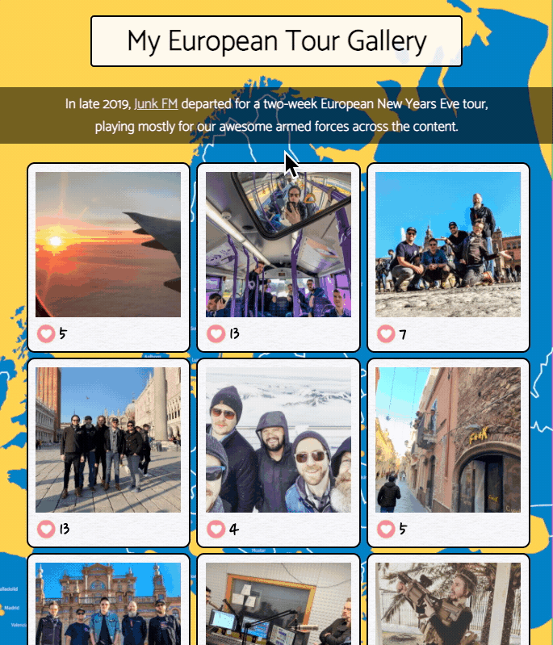

# <b>Weekend React Gallery  🖼️ </b>
 

### <b>This application is a simple - and admittedly self-centered - gallery of photos from my 2019-2020 European tour.</b>
 

---

#### _Duration: Two-Day Sprint_ 

 This simple app allows a user to click on a polaroid and see a brief description and location associated with the photo. The user can also "like" the photo via the button and see the total number of likes the photo has received.

---

---

### Prerequisites
---
- Internet browser application (e.g. Chrome, Safari)
 

## Installation
---
- No particular installation steps are required.
 

## Usage
---

- At any time, click on a photo to see the description and location
- At any time, click the  icon to add a "like" to the "like count"
 

## Built with
---
### [Visual Studio Code](https://code.visualstudio.com/), [Pixelmator Pro](https://www.pixelmator.com/pro/)
 

## License
---
N/A

 

## Acknowledgement
---
Thanks to my instructors and everyone at [Prime Digital Academy](www.primeacademy.io) for giving me the tools to do some really rad stuff. 
 

## Support
---
If you have questions or issues, please do not hesitate to email me at: [cmochinski@gmail.com](mailto:cmochinski@gmail.com). I'd love to hear from you!

---
 

_[My Twitter (@HolyMosesMusic)](https://twitter.com/holymosesmusic)_  
_[My GitHub](https://github.com/chrismochinski)_  
_[My LinkedIn](https://www.linkedin.com/in/chrismochinski/)_ 
